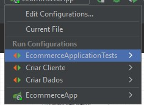
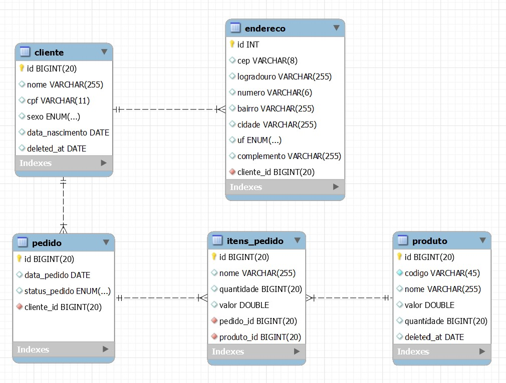

<h1 align=center>Trabalho de Persistência de Dados</h1>

<b>Objetivo:</b> Criar um sistema de cadastro de produtos e pedidos em um portal de e-commercee

<b>Inicialização do projeto</b> - Abra o terminal dentro na pasta do projeto e execute o comando `docker-compose up`
 

<b>Criar dados</b> - Para facilitar criamos duas funções de testes, a primeira para criar os dados do cliente e a segunda para criar os dados de pedido conforme print abaixo
  
  

<h3 align=center><b>Infra/Tecnologia utilizada</b></h3>
 

<h4><li>Spring Boot</li></h4>

Estrutura do projeto criado com <b>spring boot</b>.

 

<h4><li>MySQL</li></h4>

Usado no projeto como banco de dados relacional.

 

<h4><li>Redis</li></h4>

Usado para a registro de cache das requisições.

 

<h4><li>Swagger</li></h4>

Usado para a documentação das rotas, parametros e retornos do endpoints.

<a href="http://localhost:8080/api/v1/swagger-ui.html#/">Clique aqui para acessar a documentação Swagger</a>

<h3 align=center><b>MER</b></h3>

<h3 align=center><b>Funcionalidades</b></h3>

 <b>Crud de Clientes</b>
    <li>get (/clientes) - Retorna uma lista com todos os clientes, com seus respectivos endereços e pedidos</li>
    <li>get (/clientes/{id}) - Retorna o cliente pelo id com seus respectivos endereços e pedidos</li>
    <li>post (/clientes) - Cria um cliente com um ou mais endereços</li>
    <li>put (/clientes/{id}) - Atualiza o cliente pelo id</li>
    <li>delete (/clientes/{id}) - Realiza o soft delete do cliente pelo id</li>

 <b>Crud de Produtos</b>
    <li>get (/produtos) - Retorna uma lista com todos os produtos</li>
    <li>get (/produtos/{id}) - Retorna o produto pelo id</li>
    <li>post (/produtos) - Cria um produto</li>
    <li>put (/produtos/{id}) - Atualiza o produto pelo id</li>
    <li>delete (/produtos/{id}) - Realiza o soft delete do produto pelo id</li>

 <b>Crud de Endereços</b>
    <li>get (/enderecos) - Retorna uma lista com todos os endereços</li>
    <li>get (/enderecos/{id}) - Retorna o endereço pelo id</li>
    <li>post (/enderecos) - Cria um endereço</li>
    <li>put (/enderecos/{id}) - Atualiza o endereço pelo id</li>
    <li>delete (/enderecos/{id}) - Realiza o delete do endereço pelo id</li>

 <b>Crud de Pedidos</b>
    <li>get (/pedidos) - Retorna uma lista com todos os pedidos</li>
    <li>get (/pedidos/{id}) - Retorna um pedido pelo id</li>
    <li>post (/pedidos) - Cria um pedido</li>
    <li>put (/pedidos/{id}) - Atualiza o status <code>(DELETADO,CRIADO,CANCELADO,AGUARDANDO_PAGAMENTO,PAGO,EMBALANDO,ENVIADO,TRANSITO,ENTREGUE)</code> do pedido id, porque um pedido não pode ser mudado</li>
    <li>delete (/pedidos/{id}) - Realiza a troca do status do pedido para deletado</li>

